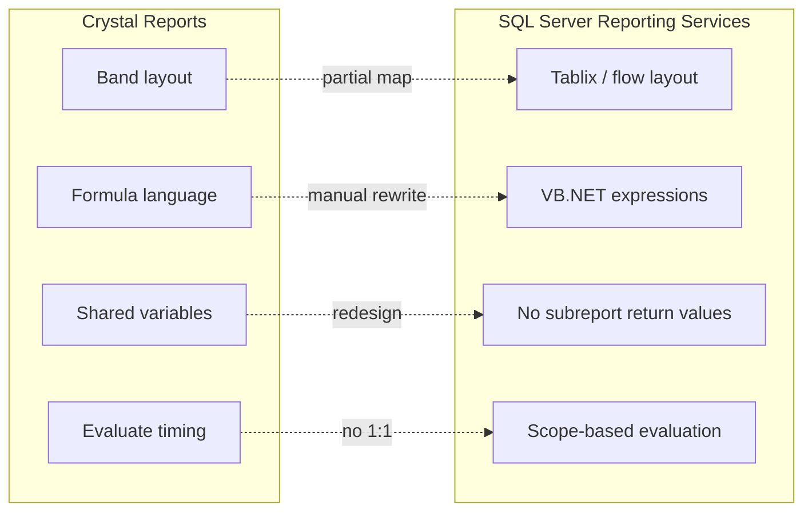
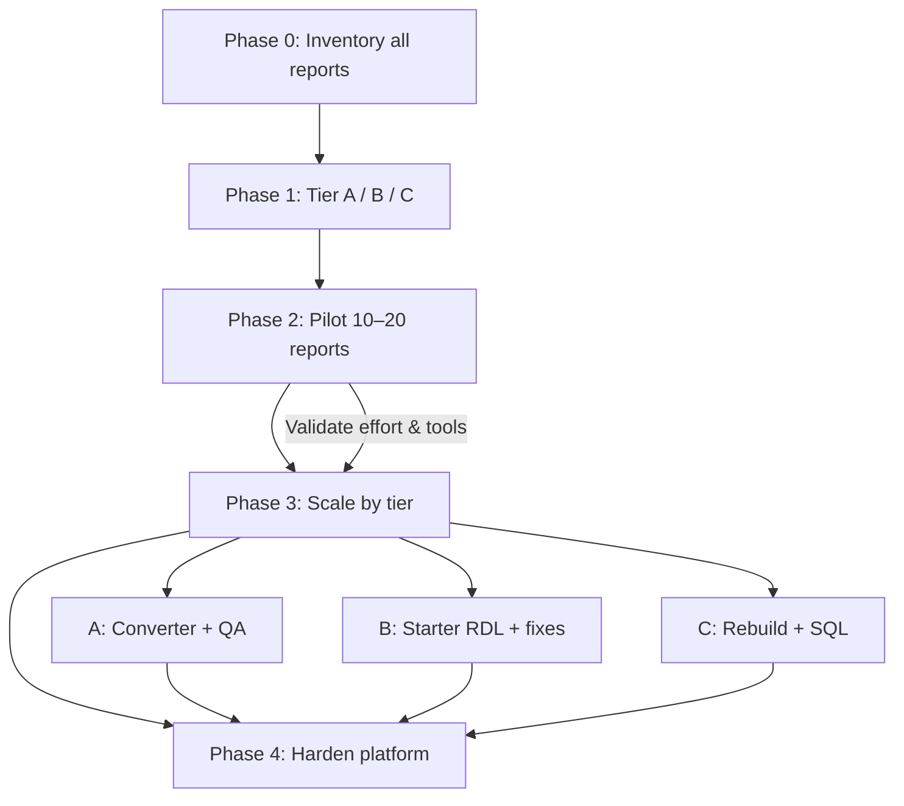
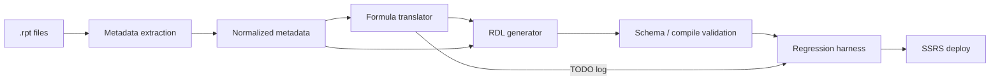
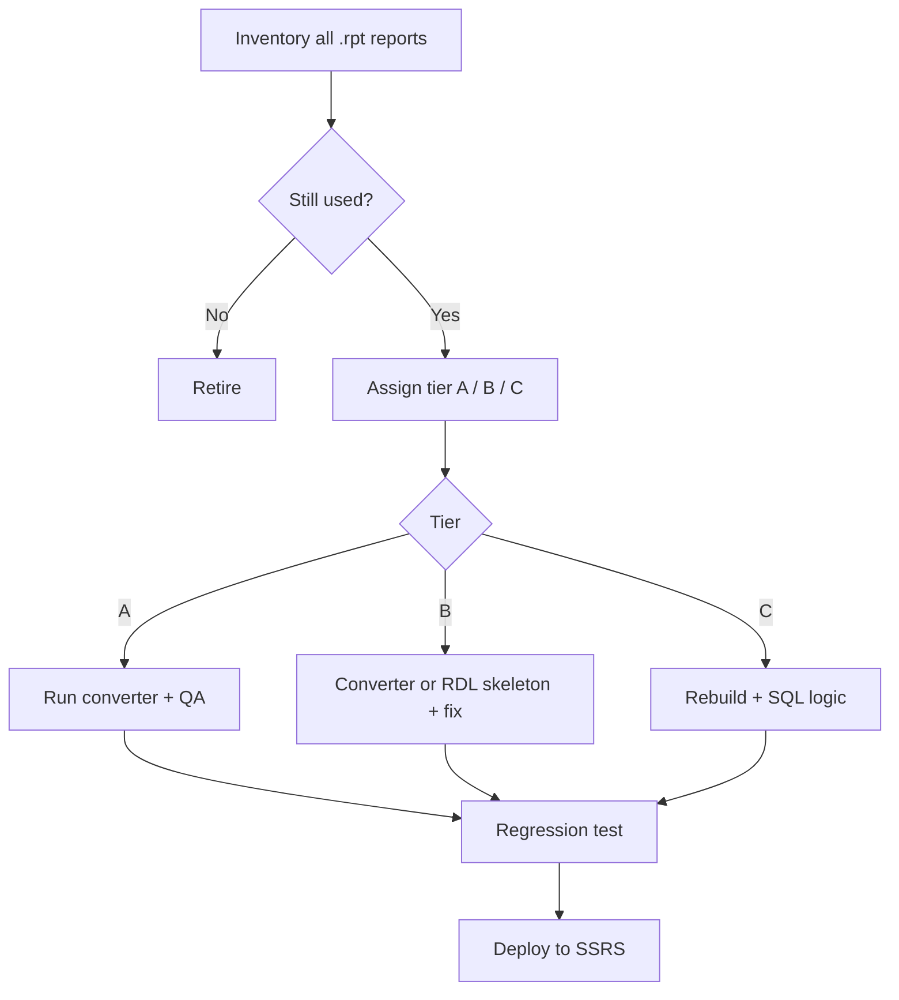

# Crystal Reports to SSRS Migration Guide

A practical guide to **automated and semi-automated** conversion from SAP Crystal Reports (`.rpt`) to SQL Server Reporting Services (`.rdl`).

---

## Table of contents

1. [Executive summary](#executive-summary)
2. [Why full automation fails](#why-full-automation-fails)
3. [Migration strategy](#migration-strategy)
4. [Report complexity tiers](#report-complexity-tiers)
5. [Commercial conversion options](#commercial-conversion-options)
6. [In-house semi-automation pipeline](#in-house-semi-automation-pipeline)
7. [Known conversion gaps](#known-conversion-gaps)
8. [Recommended operating model](#recommended-operating-model)
9. [Effort estimates](#effort-estimates)
10. [Pilot and evaluation checklist](#pilot-and-evaluation-checklist)
11. [Post-migration QA](#post-migration-qa)
12. [References](#references)

---

## Executive summary

| Reality | Implication |
|--------|-------------|
| Crystal and SSRS use different layout, formula, and data models | No tool delivers production-ready SSRS from every `.rpt` |
| Simple tabular reports convert well | Use converters + light QA |
| Complex reports (subreports, shared vars, crosstabs, print forms) | Plan for redesign or heavy manual work |
| Crystal Reports 2020 mainstream maintenance ends **31 Dec 2026** | Inventory, pilot, and scale migration now |

**Target outcome:** A repeatable process—**inventory → tier → convert or rebuild → regression test → publish**—not a one-click migration.

---

## Why full automation fails

Crystal Reports and SSRS are not equivalent platforms:

- **Layout:** Crystal bands + absolute positioning vs SSRS tablix/flow layout
- **Formulas:** Crystal formula language vs SSRS VB.NET expressions
- **Execution order:** Crystal formula evaluation timing has no direct SSRS equivalent
- **Subreports:** SSRS cannot pass values back from child to parent like many Crystal patterns
- **Aggregates:** SSRS limits aggregates of aggregates and cross-object sharing

Automated tools help with **structure and mapping**; humans (or custom tooling) still own **business logic, edge cases, and acceptance**.



---

## Migration strategy

### Phase 0: Inventory (do not skip)

For every report, capture at minimum:

- Report name and path
- Business owner and criticality
- Last run / usage frequency
- Data sources (DB, views, procs, multiple connections)
- Parameter count and types
- Count of formula fields
- Subreports (nested depth)
- Crosstabs, charts, OLAP
- UFL / COM / custom DLLs
- Export formats used (PDF, Excel, etc.)
- Print layout requirements (invoices, checks, labels)

**Retire or replace** reports with no recent use before converting.

### Phase 1: Tier every report

Assign **A**, **B**, or **C** (see [Report complexity tiers](#report-complexity-tiers)).

### Phase 2: Pilot (10–20 real reports)

Include simple, medium, and intentionally ugly reports. Measure time-to-accepted, not just “conversion succeeded.”

### Phase 3: Scale

- **A:** Converter + QA pipeline
- **B:** Converter or generated skeleton + designer cleanup
- **C:** Rebuild; push logic to SQL where possible

### Phase 4: Harden

Shared data sources, datasets, expression libraries, security, subscriptions, and a regression harness.



---

## Report complexity tiers

| Tier | Typical characteristics | Approach | Relative effort |
|------|-------------------------|----------|-----------------|
| **A – Simple** | Single query, tabular/grouped, basic formulas, no subreports | Automated converter + light QA | Low |
| **B – Medium** | Parameters, charts, crosstabs, conditional suppression, running totals | Converter as **starter** + manual fixes | Medium |
| **C – Hard** | Nested subreports, shared variables, loops/arrays in formulas, pixel-perfect docs, UFL/COM, multiple DBs | **Redesign** in SSRS; logic in views/procs | High |

**Rough portfolio split (many organizations):**

- ~40–60% A
- ~25–40% B
- ~10–20% C

One **C** report can exceed the effort of many **A** reports.

---

## Commercial conversion options

Use these for **semi-automation**: they produce `.rdl` (or RDL-compatible output) and save layout/field mapping time.

| Option | Notes |
|--------|--------|
| [Crystal Conversions](https://www.crystalconversions.com/) | RPT → RDL/RDLC; emphasis on formula recompilation; conversion logs; often service-based |
| [ReportConvert](https://www.reportconvert.com/) | Assess → convert → migrate service model |
| [Bold Reports Crystal → RDL](https://www.boldreports.com/crystal-reports-migration/) | Built-in converter; RDL usable in SSRS with cleanup; documents supported vs unsupported formula features |

**Microsoft does not ship a first-party Crystal → SSRS converter.** Treat vendor claims as marketing until your pilot proves otherwise.

### How to evaluate a tool (before licensing)

1. Select **15 reports**: 8 simple, 5 medium, 2 hard.
2. Run conversion on all 15.
3. Score each output:
   - Formulas compile without edit (%)
   - Layout vs Crystal PDF (subjective + pixel diff for print docs)
   - Parameters map correctly
   - Subreports run with correct data
   - Time from convert to **business sign-off**
4. Require a **conversion log**: mapped items, dropped features, manual TODOs.
5. Reject tools that cannot expose formulas, parameters, and data sources for review.

---

## In-house semi-automation pipeline

Suitable for **large report estates** where you want control, repeatability, and integration with your QA process.

### Step 1: Extract metadata from `.rpt`

Use Crystal Reports, RAS, or Crystal SDK (`ReportDocument`) to export:

- Tables, SQL, stored procedures
- Parameters and defaults
- Formula fields (Crystal vs Basic syntax)
- Groups, sorts, running totals
- Sections and suppression formulas
- Subreports and links
- Charts and crosstabs

Optional: XML-oriented extractors (e.g. community **RptToXml**-style tools) as input to your own parsers.

### Step 2: Generate first-pass RDL

RDL is XML. Template generation for:

- Data sources and datasets (prefer moving formulas into **SQL** here)
- Tablix from fields and groups
- Report parameters
- Simple expression mappings

### Step 3: Formula translator (high value)

Map common patterns:

| Crystal | SSRS (conceptual) |
|---------|-------------------|
| `{Table.Field}` | `Fields!Field.Value` |
| `If … Then … Else` | `IIf` / `Switch` |
| String/date/math helpers | `Mid`, `Format`, `DateAdd`, `Math.Round`, etc. |
| `IsNull` | `IsNothing` / explicit null handling |

**Stub or flag** (do not silently “convert”):

- Loops (`For`, `While`)
- Arrays and ranges
- `WhilePrintingRecords` / evaluate-after semantics
- Shared variables across sections/subreports

### Step 4: Regression harness

| Check | Method |
|-------|--------|
| Row counts | Same parameters → compare dataset row counts |
| Totals | Sum/key aggregates per parameter set |
| Output | Crystal PDF/Excel vs SSRS PDF/Excel |
| Layout | Visual diff for customer-facing print reports |

This layer turns one-off conversions into a **semi-automated factory**.



---

## Known conversion gaps

Plan manual work or redesign for:

| Area | Issue | Typical mitigation |
|------|--------|-------------------|
| Formulas | Crystal-specific functions and evaluation order | Rewrite in SSRS expressions or SQL |
| Subreports | No return values to parent | Single dataset, `Lookup`, or SQL redesign |
| Running totals | Different evaluation model | SQL window functions or SSRS scope tricks |
| Aggregates | Aggregates of aggregates | Move to query layer |
| Layout | Overlapping / absolute positioning | Rebuild tablix or use fixed-size items carefully |
| Crosstabs | Not 1:1 with Crystal | SSRS matrix + manual tuning |
| Record selection | Crystal formula filters | `WHERE` in SQL or dataset filters (watch performance) |
| UFL / COM / DLLs | Not portable | .NET custom code or remove dependency |
| Nulls | `IsNull` vs `Nothing` | Explicit null-safe expressions |

For **medium/hard** reports, fixing a bad auto-conversion can equal **rebuild from scratch**.

---

## Recommended operating model

### Do not convert 1:1 by default

1. **Retire** unused reports (usage data).
2. **A reports:** converter → visual QA → deploy.
3. **B reports:** converter or metadata-generated skeleton → fix in Report Builder / SSDT → compare totals.
4. **C reports:** rebuild; keep SSRS as presentation; put business rules in **views/stored procedures**.
5. **Shared assets:** standard data sources, shared datasets, shared expression/custom-code library.
6. **Pilot to production:** ~20 reports through security, subscriptions, and export paths before mass conversion.

### Architecture principle

> **SQL carries business logic; SSRS carries layout and interaction.**

This reduces duplicate formula maintenance across hundreds of reports.

---

## Effort estimates

*After* using a converter, per report (includes QA):

| Tier | Typical range |
|------|----------------|
| A – Simple | 0.5–2 days |
| B – Medium | 3–8 days |
| C – Hard | 1–3+ weeks |

**Converter time savings (rule of thumb):**

- Tier A: ~50–70%
- Tier B: ~20–40%
- Tier C: ~0–15% (often rebuild anyway)

Adjust for your SQL quality, test data availability, and sign-off process.

---

## Pilot and evaluation checklist

### Inventory template (per report)

```text
Report ID:
Name:
Tier (A/B/C):
Owner:
Last used:
Data sources:
# Parameters:
# Formulas:
# Subreports:
Has crosstab/chart:
Print-critical (Y/N):
Retire? (Y/N):
Notes:
```

### Pilot exit criteria

- [ ] At least 2 reports per tier converted or rebuilt
- [ ] Documented mapping rules for formulas and parameters
- [ ] Regression approach agreed (counts + PDF + key totals)
- [ ] Tool/vendor decision recorded with conversion logs reviewed
- [ ] SSRS deployment path tested (folders, security, subscriptions)
- [ ] Effort per tier validated against estimates

---

## Post-migration QA

### Functional

- All parameters: defaults, nulls, multi-value, cascading
- Group breaks and subtotals
- Page headers/footers and page numbers
- Drill-down and links (if used)
- Subreport parameter passing

### Non-functional

- Performance on production-sized data
- Timeout and query plans for heavy reports
- Excel/PDF export fidelity for regulated or customer-facing output

### Sign-off

- Business owner compares Crystal vs SSRS output for agreed parameter matrix
- Defects logged with tier tag (formula vs layout vs data) for process improvement

---

## References

- [Crystal Conversions](https://www.crystalconversions.com/)
- [ReportConvert](https://www.reportconvert.com/)
- [Bold Reports – Crystal migration](https://www.boldreports.com/crystal-reports-migration/)
- [Bold Reports – formula compatibility (blog)](https://www.boldreports.com/blog/how-to-convert-crystal-reports-to-rdl/)
- [Converting Crystal Reports to SSRS: pitfalls of automation](https://www.forrards.com/post/converting-crystal-reports-to-ssrs-pitfalls-of-automation)
- [Crystal Reports to SSRS migration (2026 practical guide)](https://reportingguru.com/crystal-reports-to-ssrs-migration/)
- [SSRS vs Crystal – parameters and formulas](http://www.crystalreportsbook.com/SSRSandCR_ParametersAndFormulas.asp)

Related in this repo: [Spec-to-RDL user stories](user-stories/crystal-reports-2-ssrs.md)

---

## Quick decision flow



---

*Document purpose: semi-automated Crystal Reports → SSRS migration planning and execution. Update tier rules and tool evaluation results after your pilot.*
